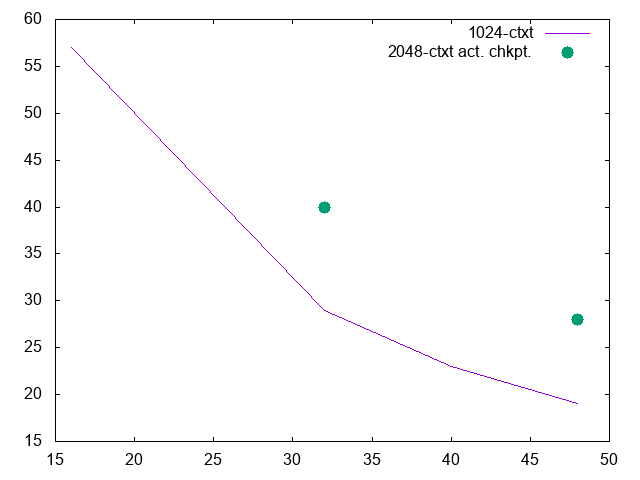
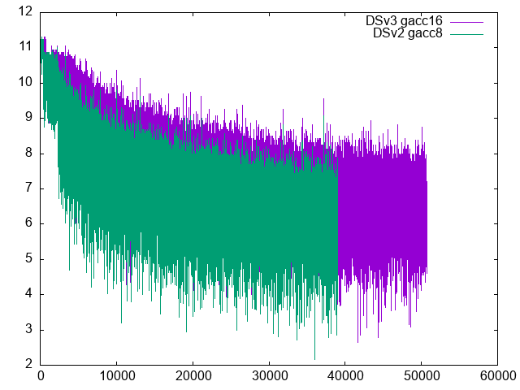
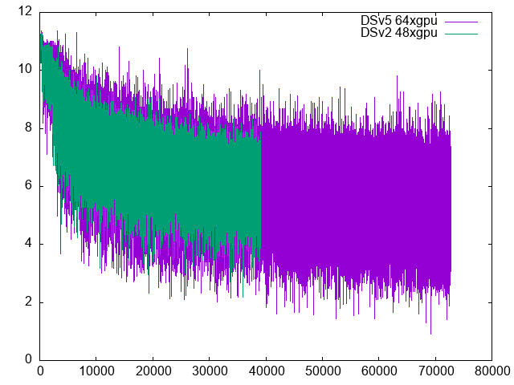
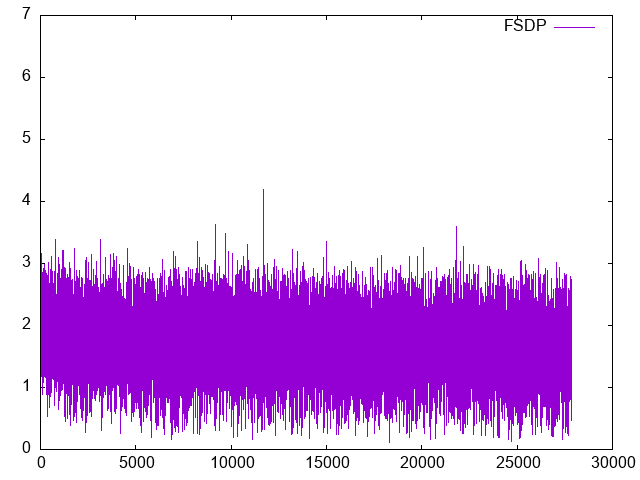
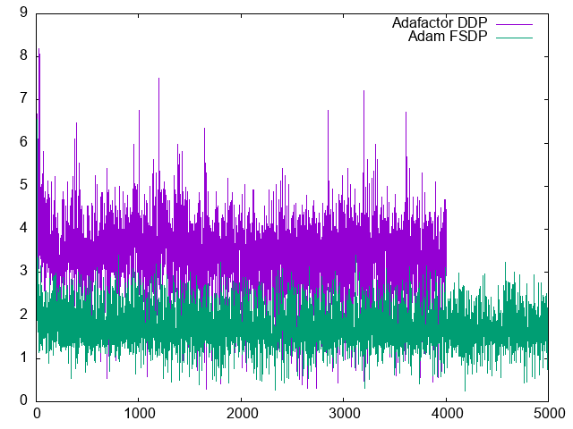
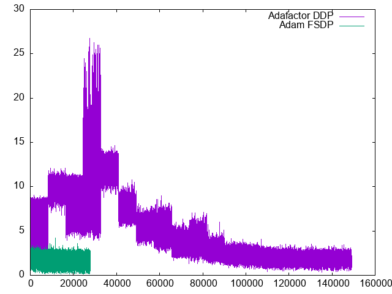
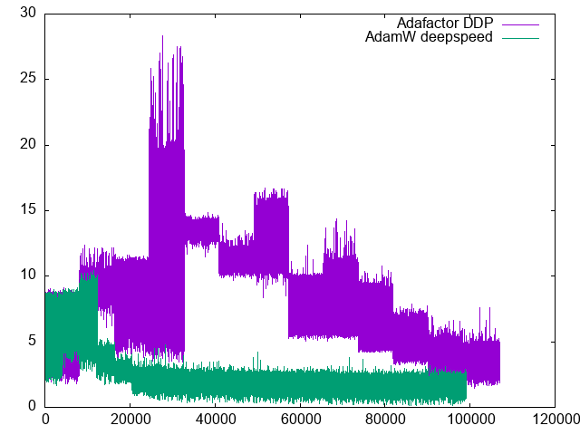

## Deepspeed

Number of compute-days to train on 100b tokens as a function of the number of GPUs:

## Raw speed results

### On Jean Zay

- FSDP, bloom-7b, batchsize=2, context=1024, 8xA100: 200 jours pour 100b tokens
    - FSDP sur 16xA100: 2x plus lent, car interconnection entre les noeuds trop lente ! Mais on pourrait tenter avec gradient accumulation…

- Deepspeed stage 1, AdamW, bloom-7b, bs=1, context=1024, 8xA100: 258 jours pour 100b tokens
- Deepspeed stage 1, AdamW, bloom-7b, bs=2, context=1024, 16xA100:  2x plus lent!

- DDP+gradient checkpointing+adafactor, bloom-7b, bs=1, context=1024, 2xA100: 1200 jours pour 100b tokens
- DDP+gradient checkpointing+adafactor, bloom-7b, bs=1, context=1024, 8xA100: 350 jours pour 100b tokens
    - gradient checkpointing + diff(DDP,DS1) coute +36% en temps de calcul
- DDP+gradient checkpointing+adafactor, bloom-7b, bs=1, context=1024, 16xA100: 700 jours pour 100b tokens
    - Toujours ce facteur X2 sur 2 nodes alors que c’est du DDP de base !
- DDP+gradient checkpointing+adafactor+gradient compression (powerSGD), bloom-7b, bs=1, context=1024, 16xA100: 500 jours pour 100b tokens
- DDP+gradient checkpointing+adafactor+gradient compression (powerSGD), bloom-7b, bs=2, context=1024, 8xA100: 335 jours pour 100b tokens
- DDP+gradient checkpointing+adafactor+gradient compression (powerSGD) + gradient accumulation (256), bloom-7b, bs=2, context=1024, 16xA100:  73 jours pour 100b tokens
- DDP+gradient checkpointing+adafactor+gradient compression (powerSGD) + gradient accumulation (256), bloom-7b, bs=2, context=1024, 32xA100: 36 jours pour 100b tokens
- DDP+gradient checkpointing+adafactor+gradient compression (powerSGD) + gradient accumulation (256), bloom-7b, bs=2, context=2048, 32xA100: 40 jours pour 100b tokens

- Deepspeed stage 1+ gradacc 256, AdamW, bloom-7b, bs=2, context=1024, 16xA100:  57 jours pour 100b tokens
- Deepspeed stage 1+ gradacc 256, AdamW, bloom-7b, bs=2, context=1024, 32xA100:  **29 jours pour 100b tokens**
- Deepspeed stage 1+ gradacc 256, AdamW, bloom-7b, bs=2, context=1024, 40xA100:  **23 jours pour 100b tokens**
- Deepspeed stage 1+ gradacc 256, AdamW, bloom-7b, bs=2, context=1024, 48xA100:  **19 jours pour 100b tokens**
- Deepspeed stage 2+ gradacc 256, AdamW, bloom-7b, bs=2, context=2048, 32xA100: crash OOM, de plus, 20% des GPU sont à 0% alors que dans les tests precedents, tous les GPU sont a 100%
- Deepspeed stage 1+ gradacc 256 + gradient checkpointing, AdamW, bloom-7b, bs=2, context=2048, 32xA100: **40 jours pour 100b tokens**
- Deepspeed stage 1+ gradacc 256 + gradient checkpointing, AdamW, bloom-7b, bs=2, context=2048, 48xA100: **28 jours pour 100b tokens**
- Deepspeed stage 1+ gradacc 64 + gradient checkpointing, AdamW, bloom-7b, bs=2, context=1024, 8xA100: 147 jours pour 100b tokens
    - Le DeepSpeed profiler donne pour cette config 88 TFlops/gpu soit 91168 token/s

### On Adastra

- FSDP, bloom-7b, batchsize=2, context=1024, 2xMI150X: 1500 jours pour 100b tokens
- FSDP, bloom-7b, batchsize=2, context=1024, 4xMI150X: crash OOM

### With 2048-ctxt dataset from Megatron

- Deepspeed stage 3, gradacc 1, act_chkpting, AdamW, bloom-7b, bs 1, 2xA100:  **600 jours pour 100b tokens**
    - VRAM hyper-limite: warnings de GPU cache flushing
- Deepspeed stage 3, gradacc 1, act_chkpting, AdamW, bloom-7b, bs 1, 16xA100:  **585 jours pour 100b tokens**
- Deepspeed stage 3, gradacc 16, act_chkpting, AdamW, bloom-7b, bs 1, 16xA100:  **560 jours pour 100b tokens**
- Deepspeed stage 3, gradacc 16, NO act_chkpting, AdamW, bloom-7b, bs 1, 32xA100:  **252 jours pour 100b tokens**
- Deepspeed stage 3, gradacc 16, NO act_chkpting, AdamW, bloom-7b, bs 1, 32xA100:  **249 jours pour 100b tokens**
    - plus lent que avant, pourquoi ? 1) seqs 2048 ? 2) gradacc ? 3) bs ? 4) stage 2 ?
    - j'avais avant: Deepspeed stage 1+ gradacc 256 + gradient checkpointing, AdamW, bloom-7b, bs=2, context=2048, 32xA100: **40 jours pour 100b tokens**
    - VRAM a 60GB: pourrait augmenter bs
- Deepspeed stage 3, gradacc 256, NO act_chkpting, AdamW, bloom-7b, bs 2, 32xA100:  **218 jours pour 100b tokens**
    - DIFF: avant, on avait la VRAM=33GB, maintenant VRAM=5GB !! (a cause du Stage 3!)
    - DIFF: avant, pas de warning, now, warning "UserWarning: c10d::broadcast_: an autograd kernel was not registered to the Autograd key(s) but we are trying to backprop through it" ==> version de apex / deepspeed !!!
    - DIFF: je suis en stage 3 en fait !!!!
- Deepspeed stage 1, gradacc 256, act_chkpting, AdamW, bloom-7b, bs 2, 32xA100:  **36 jours pour 100b tokens**
    - mais tres mauvaise convergence, both gradacc et LR sont mauvais...
- Deepspeed stage 1, gradacc 16, act_chkpting, AdamW, bloom-7b, bs 2, 48xA100:  **34 jours pour 100b tokens**
- Deepspeed stage 1, gradacc 8, act_chkpting, AdamW, bloom-7b, bs 1, 48xA100:  **44 jours pour 100b tokens**
    - a partir de ce res, je delegue a deepspeed l'optimizer+LR scheduler: les courbes de loss sont bien meilleures !
    - config: DSv2
- Deepspeed stage 1, gradacc 16, act_chkpting, AdamW, bloom-7b, bs 1, 48xA100:  **34 jours pour 100b tokens**
    - config: DSv3: cf. courbe ci-dessous pour voir le compromis entre throughput et loss decrease
    - ceci donne un global batch size = 1.6M tokens
- Deepspeed stage 1, gradacc 8, act_chkpting, AdamW, bloom-7b, bs 2, 48xA100:  **43 jours pour 100b tokens**
    - config: DSv4: meme loss que DSv2, mais un tout petit poil plus rapide
    - attention: il y a batchsize dans dataloader et dans deepspeed: est-ce OK ?
- Deepspeed stage 1, gradacc 8, act_chkpting, AdamW, bloom-7b, bs 4, 48xA100:  **66 jours pour 100b tokens**
    - exactement la meme loss que bs=1 mais c'est juste bcp plus lent en throughput (bizarre...): je suppose que c'est du a une mauvaise utilisation des GPUs
- Deepspeed stage 1, gradacc 4, act_chkpting, AdamW, bloom-7b, bs 1, 48xA100:  **50 jours pour 100b tokens**
    - un epsilon meilleur au debut de la loss que DSv2, mais la diff de loss est negligeable et en contrepartie, il perd trop en throughput
- Deepspeed stage 1, gradacc 8, act_chkpting, AdamW, bloom-7b, bs 1, 64xA100:  **23 jours pour 100b tokens**
    - config DSv5: LR=1e-5
    - l'utilisation des GPU est bonne, mais un peu moins optimale que DSv2: la lenteur du reseau doit se faire sentir
- Deepspeed stage 1, gradacc 8, act_chkpting, AdamW, bloom-7b, bs 1, 64xA100:  **23 jours pour 100b tokens**
    - LR=1e-4
    - converge au meme point, mais 1e-4 est plus instable au debut 
- Deepspeed stage 1, gradacc 8, act_chkpting, AdamW, bloom-7b, bs 1, 80xA100:  **21 jours pour 100b tokens**
    - LR=2e-5
    - meme convergence que ci-dessus, mais un peu plus long
- Deepspeed stage 1, gradacc 8, act_chkpting, 1bitLamb, bloom-7b, bs 1, 64xA100:  **jours pour 100b tokens**
    - config DSv6: LR=1e-5

## April loss curves

## Preliminary loss curves

- FSDP: bonne convergence

- Deepspeed: idem
- DDP avec Adafactor: il train, mais plus difficile a tuner !

- DDP + grad accu 256: needs some tuning for sure, but this curve shows clearly the compromise to find between compensating for inter-node slowness and trying to not impact convergence speed too much…

Deepspeed + gradaccu 256 (pas de gradient checkpointing !): meilleure convergence grace a Adam, et devrait etre plus rapide a GPU egaux grace a gradient accumuluation: preferred option

